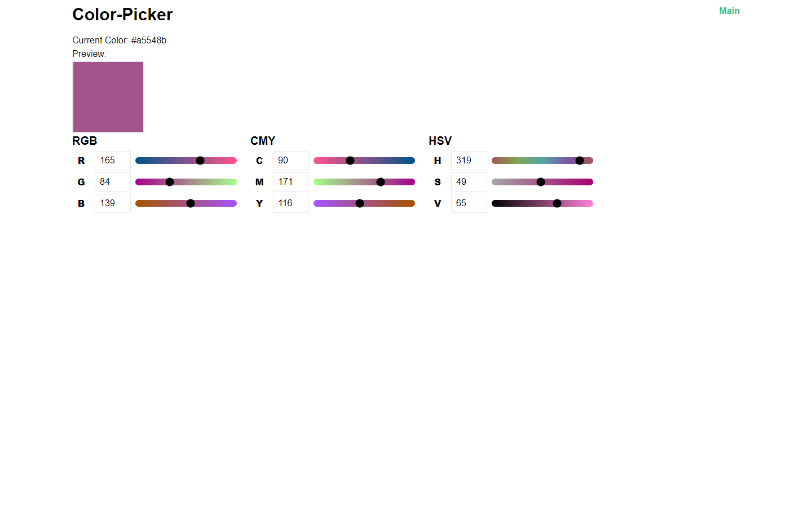

# Color Calculator

This project is involves three color models: `RGB`, `HSV` and `CMY` (not `CMYK`). Main idea - to perform calculations between three models and render changes.

## Preview on Desktop

## Links

Visit this [link](https://vue-color-calculator-stanekso.vercel.app) to check by yourself.!

## Technologies

- Vue.JS
- Vuex (Source of all colors)
- TailwindCSS for styling

## Project Features

- Simultaneous changes on all inputs
- Both numeral and range inputs to control colors.
- Preview for color
- HEX color (In my opinion - convenient)
- There is only one true color: RGB. Other colors are computed using Vuex
